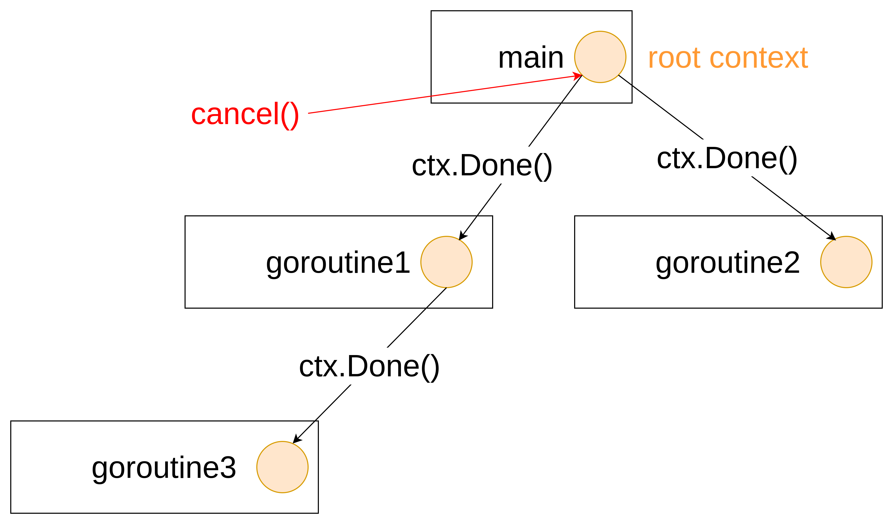

# golang-order-api

This repository is for demo how to implement a CRUD api with golang on redis

## setup basic http router 

1. setup router with chi

```golang
func main() {
	// setup chi router
	router := chi.NewRouter()
	router.Get("/hello", basicHandler)
	server := &http.Server{
		Addr:    ":8001",
		Handler: router,
	}
	err := server.ListenAndServe()
	if err != nil {
		fmt.Println("failed to listen to server", err)
	}
}

func basicHandler(w http.ResponseWriter, r *http.Request) {
	w.Write([]byte("Hello, world!"))
}
```

2. setup middleware logger

```golang
// in main function after router setup
	// add middleware logger
	router.Use(middleware.Logger)	
```

## setup orders handler

```golang
package handler

import (
	"fmt"
	"net/http"
)

type Order struct {
}

func (o *Order) Create(w http.ResponseWriter, r *http.Request) {
	fmt.Println("Create an order")
}

func (o *Order) List(w http.ResponseWriter, r *http.Request) {
	fmt.Println("List all ordres")
}

func (o *Order) GetByID(w http.ResponseWriter, r *http.Request) {
	fmt.Println("Get an ordre by ID")
}

func (o *Order) UpdateByID(w http.ResponseWriter, r *http.Request) {
	fmt.Println("Update an ordre by ID")
}

func (o *Order) DeleteByID(w http.ResponseWriter, r *http.Request) {
	fmt.Println("Delete an ordre by ID")
}
```

## setup redis with docker compsoe

```yaml
services:
  redis:
    image: redis:latest
    container_name: redis
    restart: always
    ports:
      - 6379:6379
    volumes:
      - ./data:/data
```

## app start up dependency


### setup connection redis state in app struct

```golang
type App struct {
	router http.Handler
	rdb    *redis.Client
}

func New() *App {
	app := &App{
		router: loadRoutes(),
		rdb:    redis.NewClient(&redis.Options{}),
	}

	return app
}
```
add ping check before app.Listen
```golang
// in Start function after before app.Listen do ping check
err := a.rdb.Ping().Err()
if err != nil {
	return fmt.Errorf("failed to connect redis: %w", err)
}
```
## setup graceful shutdown with context

use context api to notify signal from parent to child goroutine



1. setup signal capture in main.go
```golang
ctx, cancel := signal.NotifyContext(context.Background(), os.Interrupt)
defer cancel()
err := app.Start(ctx)
```

2. setup listener for ctx cancel event

```golang
select {
case err = <-ch:
	return err
case <-ctx.Done():
	timeout, cancel := context.WithTimeout(context.Background(), time.Second*10)
	defer cancel()
	return server.Shutdown(timeout)
}
```

explain: select could listen multiple channel for signal notify

## setup redis repostiory

